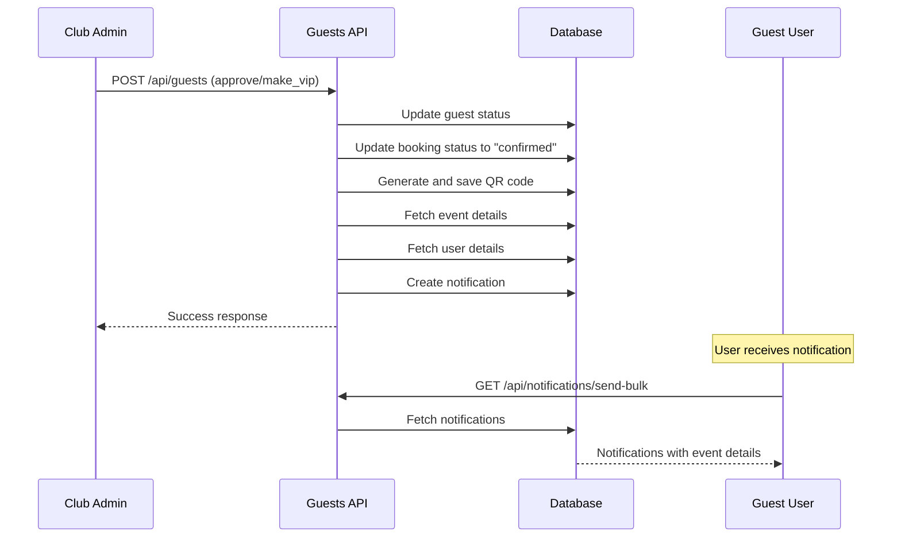

# Guest List Notification Implementation

## Overview
This document describes the notification system implementation for guest list approvals and VIP access grants.

## Database Schema
The notifications are stored in the `notifications` table with the following schema:

| Column | Type | Nullable | Default |
|--------|------|----------|---------|
| id | uuid | ❌ | uuid_generate_v4() |
| user_id | uuid | ❌ | — |
| title | text | ❌ | — |
| message | text | ❌ | — |
| type | text | ✅ | 'general' |
| metadata | jsonb | ✅ | {} |
| is_read | boolean | ✅ | false |
| read_at | timestamptz | ✅ | null |
| created_at | timestamptz | ✅ | now() |
| updated_at | timestamptz | ✅ | now() |

## Implementation Details

### File Modified
**`/Users/harsh/Bassh/web/app/api/guests/route.ts`**

### Changes Made

#### 1. Enhanced Guest Fetch Query
The guest fetch query now includes additional fields needed for notifications:
- `user_id` - To identify who to send the notification to
- `event_id` - To fetch event details for the notification message

```typescript
const { data: guest, error: guestError } = await supabaseAdmin
  .from("guests")
  .select("id, club_id, booking_id, user_id, event_id")
  .eq("id", guest_id)
  .eq("club_id", clubId)
  .single();
```

#### 2. Notification Logic
After approving a guest or granting VIP access, the system now:

1. **Fetches Event Details**
   ```typescript
   const { data: event } = await supabaseAdmin
     .from("events")
     .select("name")
     .eq("id", guest.event_id)
     .single();
   ```

2. **Fetches User Details**
   ```typescript
   const { data: userDetails } = await supabaseAdmin
     .from("users")
     .select("name")
     .eq("id", guest.user_id)
     .single();
   ```

3. **Creates Notification**
   ```typescript
   await supabaseAdmin
     .from("notifications")
     .insert({
       user_id: guest.user_id,
       title: notificationTitle,
       message: notificationMessage,
       type: "guest_list",
       metadata: {
         booking_id: bookingId,
         event_id: guest.event_id,
         is_vip: action === "make_vip",
       },
       is_read: false,
       created_at: new Date().toISOString(),
     });
   ```

### Notification Types

#### Guest List Approval
- **Title:** "Guest List Approved! 🎉"
- **Message:** "You're on the guest list for [Event Name]. See you at the event!"
- **Type:** "guest_list"
- **Metadata:**
  - `booking_id`: The booking ID
  - `event_id`: The event ID
  - `is_vip`: false

#### VIP Access Grant
- **Title:** "VIP Access Granted! 🌟"
- **Message:** "Congratulations! You've been granted VIP access to [Event Name]. See you at the event!"
- **Type:** "guest_list"
- **Metadata:**
  - `booking_id`: The booking ID
  - `event_id`: The event ID
  - `is_vip`: true

## Workflow



## Error Handling
- The notification sending is wrapped in a try-catch block
- If notification creation fails, it logs the error but doesn't block the guest approval process
- This ensures that guest approvals always succeed even if notifications fail

```typescript
try {
  // Notification logic
  console.log(`✅ [NOTIFICATIONS] Sent ${action} notification to user ${guest.user_id}`);
} catch (notifErr: any) {
  console.error("❌ Failed to send guest list notification:", notifErr);
  // Don't block the guest update if notification fails
}
```

## Related Files

### Notification API Endpoints
1. **`/Users/harsh/Bassh/web/app/api/notifications/send-bulk/route.ts`**
   - POST: Send bulk notifications to multiple users
   - GET: Get all notifications for authenticated user
   - PATCH: Mark notifications as read
   - DELETE: Delete notifications

2. **`/Users/harsh/Bassh/web/app/api/notifications/router.ts`**
   - GET /send-all: Fetch all notifications with enriched booking data
   - PATCH /send-all: Mark all notifications as read

### Reference Implementation
**`/Users/harsh/Bassh/myApp/app/event/[id]/book.tsx`**
- Shows how notifications are sent after booking confirmation
- Similar pattern used for guest list notifications

## Testing

### Manual Testing Steps
1. Create a guest list entry for an event
2. As a club admin, approve the guest or grant VIP access
3. Verify the notification appears for the guest user
4. Check that the notification contains:
   - Correct title (based on action)
   - Event name in the message
   - Metadata with booking_id and event_id
   - is_vip flag set correctly

### Database Query to Verify
```sql
SELECT 
  n.*,
  u.name as user_name,
  e.name as event_name
FROM notifications n
JOIN users u ON n.user_id = u.id
JOIN events e ON (n.metadata->>'event_id')::uuid = e.id
WHERE n.type = 'guest_list'
ORDER BY n.created_at DESC;
```

## Future Enhancements
1. Add push notification support for real-time alerts
2. Include event date/time in notification metadata
3. Add email notification option
4. Allow users to customize notification preferences
5. Add notification for when guest is suspended
6. Include club details in notification

## Notes
- The notification system follows the same pattern as booking confirmations
- Notifications are stored directly in the database, not sent via the bulk API
- The system uses the existing `notifications` table structure
- Metadata is stored as JSONB for flexible data storage
